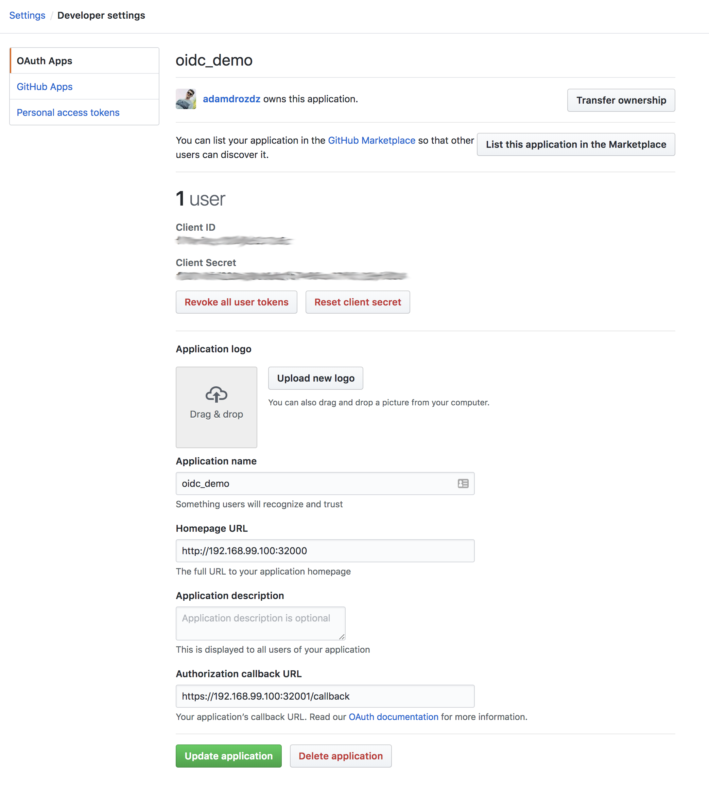

---

# Demo
---
Requirements

 * minikube
 * openssl
 * kubectl

Lets run through the demo
- 
* Setup your GitHub OAuth App `https://github.com/settings/developers`
 

* Set yours environment variable - we will use it later:

	```
	 export CLIENT_ID=kubernetes
	 export CLIENT_SECRET=proxy
	 export GITHUB_CLIENT_ID=client_id_from_github_oauth_app
	 export GITHUB_CLIENT_SECRET=client_secret_from_github_oauth_app
	 

* Make sure minikube start fresh with `minikube delete`
* Create a new minikube cluster `01_minikube.sh`
* So we have our cluster up and running and it is configured to accept oidc tokens from our IdP, how do we generate the tokens?
* We need to run dex - our own IdP witht we use with GitHub connector
* Run `02_deploy_dex.sh`
* We need to run the dashboard with our openresty container in front of it. That container needs to know the client id and secret that we created in DEX
* Now we deploy our dashboard pod with `03_deploy_dashboard.sh`
* If we go to the dashboard endpoint `http://192.168.99.100:32000/` we should now get redirected to DEX and be able to log in with GitHub
* This will give us access to the dashboard! But the dashboard is telling us our user does not have access to anything :(
* Put your GitHub email in those files:

	```
	roles/role0.yaml
	roles/role1.yaml

* If we deploy some roles

 
 	```
	kubectl create -f roles/role0.yaml 
		or
 	kubectl create -f roles/role1.yaml
 	```
  and after that we refresh dashboard, then things should start working